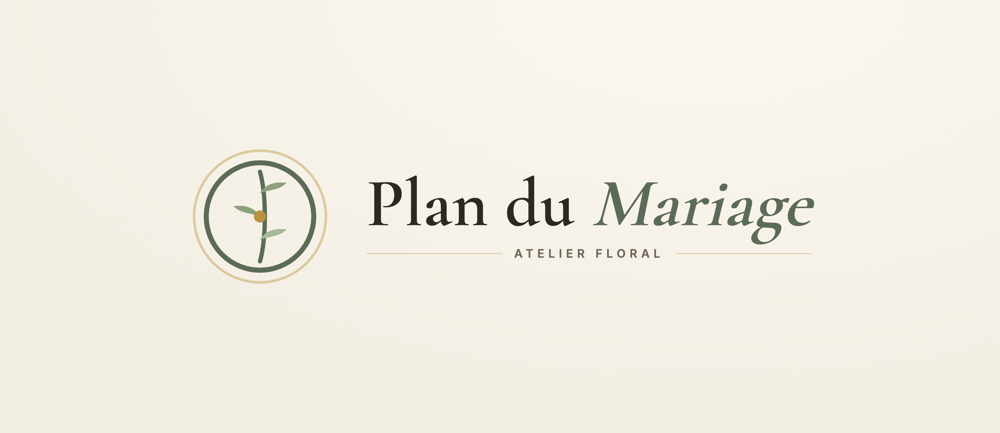

# Logo — « Atelier Floral »

## Intention
Un logo de **papeterie de mariage** : un petit sceau végétal, élégant et intemporel,
qui pourrait figurer en filigrane sur un faire-part. Il doit dire « mariage » et
« plan » à la fois, sans cliché (pas de cœur, pas d'alliance, pas d'emoji).

## Forme
Un **cercle fin** (la table ronde vue de dessus / le rond d'un sceau) qui enserre une
**brindille d'eucalyptus** stylisée (tige + trois feuilles). Au centre, un **point
doré** discret. Dans la version logo complète, un **second cercle doré très fin**
entoure le tout (effet médaillon / sceau).

## Symbolique
- Le **cercle** = la table ronde, élément fondateur de l'app ; aussi le sceau, l'union.
- La **brindille d'eucalyptus** = le végétal des mariages contemporains, la fraîcheur,
  le soin apporté à la décoration.
- Le **point doré** = le détail précieux, la touche premium.

## Couleurs
- Tracé : **olivier `#5C6B57`**.
- Feuilles : olivier + `#8DA17C` / `#A7B898` (dégradé de sauge).
- Cœur & anneau médaillon : **or `#B8923C` / `#DCC9A0`**.
- Fond du lockup : ivoire dégradé (`#FCF8F0 → #F4EFE5`).

## Cohérence avec l'application
Reprend exactement la couleur signature (olivier) et l'accent or de l'interface. La
brindille fait écho aux fonds eucalyptus du plan. Le titre du lockup est en **Cormorant
Garamond** (« Mariage » en italique olivier), comme le titre de la barre supérieure →
continuité parfaite entre marque et produit. Une pastille `.marque` reprend le cercle +
brindille dans l'en-tête.

## Variantes
- **Monogramme seul** (cercle + brindille) — favicon, pastille d'en-tête, app icon.
  Fichier source : [`demo/marque.svg`](demo/marque.svg).
- **Lockup horizontal** (monogramme + « Plan du Mariage » + tagline) — écran d'accueil,
  documents. Fichier source : [`logo.html`](logo.html) → `logo-PlanDuMariage.png`.
- **Monochrome** : tout en olivier (ou tout en encre) pour impression / tampon.
- **Inversé** : tracé ivoire sur aplat olivier pour fonds sombres.
