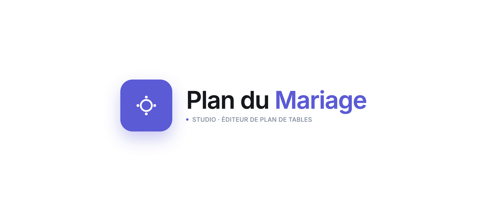

# Logo — « Studio Linéaire »

## Intention
Un **app icon** au sens produit du terme : une tuile carrée arrondie, comme une
application qu'on épinglerait dans une barre d'outils. Immédiatement « logiciel », net,
reconnaissable en favicon comme en 1024 px.

## Forme
Tuile **carré arrondi** (rayon ~30 % ) remplie d'indigo, contenant un pictogramme blanc
en ligne : un **cercle** (la table) entouré de **quatre points cardinaux** (les couverts /
les places, ou les axes de placement). Lecture instantanée : « une table et ses places,
posées dans un espace ».

## Symbolique
- **Le carré** = l'espace, la pièce, le cadre du plan.
- **Le cercle** = la table ronde.
- **Les 4 points** = les convives autour, et la précision du positionnement (axes N/E/S/O).

## Couleurs
- Tuile : **indigo `#5B5BD6`**.
- Pictogramme : blanc `#FFFFFF`.
- Ombre portée teintée indigo pour l'effet « icône d'app ».
- Wordmark : ink `#16181D`, « Mariage » en indigo.

## Cohérence avec l'application
La tuile **est** l'accent de l'interface (même indigo que le bouton primaire, le focus,
la sélection). Le pictogramme « table + places » résume littéralement la fonction du
produit. Le wordmark est en **Inter**, la police unique de l'app → zéro rupture.

## Variantes
- **Tuile seule** — favicon, app icon, pastille d'en-tête. Source : [`demo/marque.svg`](demo/marque.svg).
- **Lockup horizontal** — tuile + « Plan du Mariage » + tagline « STUDIO · ÉDITEUR DE
  PLAN DE TABLES ». Source : [`logo.html`](logo.html).
- **Monochrome** : pictogramme indigo (ou ink) sur fond transparent, sans tuile, pour
  contextes sobres.
- **Inversé** : tuile blanche, pictogramme indigo, pour fonds colorés.
