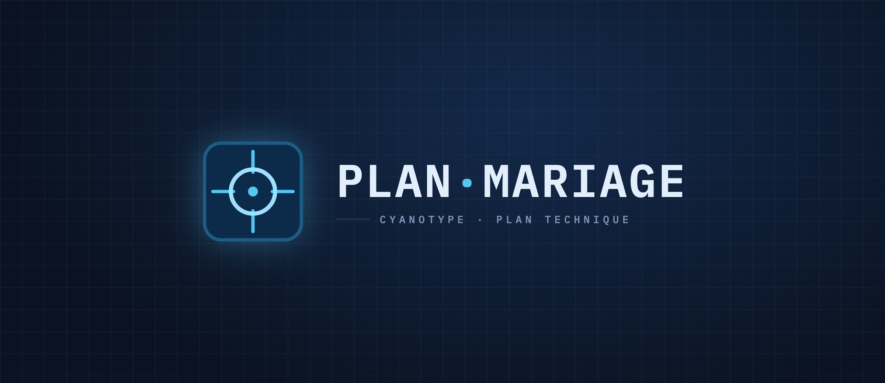

# Logo — « Cyanotype »

## Intention
Un logo d'**instrument de précision** : un réticule de visée dans une tuile sombre,
comme l'icône d'un logiciel de CAO ou d'un théodolite. Il signe le sérieux technique et
la promesse centrale de l'app — **placer au bon endroit, au centimètre près**.

## Forme
Tuile **carré arrondi** bleu nuit, bordée d'un fin trait cyan. À l'intérieur, un
**réticule** : quatre tirets cardinaux (N/E/S/O) qui visent un **cercle** central (la
table) marqué d'un **point** cyan. L'ensemble baigne dans une légère lueur.

## Symbolique
- **Le réticule / la mire** = viser, centrer, positionner avec précision.
- **Le cercle** = la table ronde.
- **Le point central** = le point d'ancrage exact, la cote.
- **Le bleu cyan sur nuit** = le tirage cyanotype, le plan d'architecte.

## Couleurs
- Tuile : bleu de Prusse `#0C2A4A`, bord `#1E5C84`.
- Réticule : cyan `#54C6F0`.
- Cercle : cyan clair `#9FE0FF`.
- Point : cyan `#54C6F0`, avec glow.
- Wordmark : `#E2EEFB`, séparateur cyan.

## Cohérence avec l'application
Le cyan du réticule **est** la couleur d'accent de l'interface (boutons, focus,
sélection, cotes, murs lumineux). Le motif de visée reprend les **numéros de coins** et
la logique de placement du plan. Le wordmark est en **IBM Plex Mono** majuscule, comme
le titre de la barre supérieure → continuité totale. Le réticule peut aussi servir
d'icône d'action « centrer la vue ».

## Variantes
- **Réticule seul** (tuile) — favicon, app icon, pastille d'en-tête. Source : [`demo/marque.svg`](demo/marque.svg).
- **Lockup horizontal** — réticule + « PLAN · MARIAGE » + tagline « Cyanotype · Plan
  technique ». Source : [`logo.html`](logo.html).
- **Monochrome cyan** : réticule + texte cyan sur transparent (sur fonds sombres).
- **Version claire** : pour un éventuel mode jour, réticule bleu nuit sur tuile claire —
  même géométrie, valeurs inversées.
